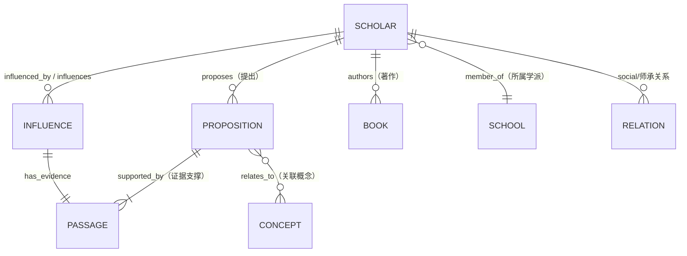

# 🗞️ 新闻传播学知识图谱 (News & Journalism Knowledge Graph)

> **一个证据可追溯、可视化呈现、人类可维护的新闻学与传播学学术知识图谱**  
> 收录中西方学者、理论命题、经典著作及其学术影响关系，支持中英文双语展示。

> **🖼️ 图文并茂升级**  
> 推荐在 `assets/screenshots/` 目录下添加真实截图，使 README 更直观。

---

## 🌟 项目简介

你是否曾经想过：

- 麦克卢汉的“媒介即讯息”到底受谁启发？
- 李普曼的《舆论学》如何影响后世议程设置理论？
- 中国近代新闻思想与西方传播学派之间有哪些隐秘的对话？

这个项目就是为了回答这些问题而生！

我们构建了一个**结构化、可视化、可追溯**的知识网络，像一张“学术家族树”一样，把新闻传播领域的思想脉络清晰呈现出来。所有数据都来自公开文献，每一条连线都有证据支撑。

### 为什么选择这个项目？

| 痛点 | 本项目的解决方式 |
|------|------------------|
| 理论散落在各种教材和论文中，难以串联 | 结构化命题 + 影响关系，一目了然 |
| 想找原始证据却翻遍图书馆 | 每条命题绑定 passage 证据段落 + 来源链接 |
| 新手面对一堆学派名称不知从何学起 | 时间轴 + 知识图谱 + 学派筛选，循序渐进 |
| 想自己补充数据却不会写代码 | 纯 CSV 编辑 + 一键校验，新手友好 |

**适合人群**：
- 🎓 新闻传播专业本科生 / 研究生（复习神器）
- 👩‍🏫 高校教师（备课找案例、证据超方便）
- 🔬 传播学 / 新闻史研究者（快速定位影响链条）
- 🧐 对媒介与社会感兴趣的终身学习者

---

## 🚀 5 分钟快速开始（新手必看）

### 1. 环境准备

- **Python**：3.8 或更高版本（[下载地址](https://www.python.org/downloads/)）
- **浏览器**：推荐 Chrome / Edge / Firefox（最新版）
- **编辑器**（可选但推荐）：VS Code + “Edit CSV” 插件，或 Excel（保存为 UTF-8 CSV）

### 2. 获取项目

```bash
# 方式一：使用 Git（推荐）
git clone https://github.com/Yuuqq/news-journalism-kg.git
cd news-journalism-kg

# 方式二：直接下载 ZIP（GitHub 页面右上角 Code → Download ZIP）
```

### 3. 启动本地工作台（Workbench）

**Windows 用户（最简单）**：
```bash
# 双击运行
run_workbench.bat

# 或在命令提示符 / PowerShell 中执行
python workbench\server.py
```

**macOS / Linux 用户**：
```bash
python3 workbench/server.py
```

启动成功后，浏览器自动打开或手动访问：
**http://127.0.0.1:8125**

你会看到一个漂亮的单页应用，包含多个标签页！

### 4. 探索功能（推荐顺序）

1. 先看 **Dashboard 概览** → 了解数据规模
2. 进入 **Scholars 学者名录** → 按学派筛选，点击卡片看详情
3. 切换到 **Timeline 时间轴** → 拖动或点击年份，感受理论演进
4. 打开 **Graph 知识图谱** → 用鼠标拖拽节点，探索关系网络
5. 最后去 **Influence 影响网络** 和 **Browse 证据库** 深入挖掘

### 5. 构建静态站点（部署用）

```bash
python scripts/build_static.py
```

构建完成后，`dist/` 文件夹里的内容可以直接部署到：
- Netlify（推荐，`netlify.toml` 已配置）
- GitHub Pages
- Vercel / Cloudflare Pages 等

---

## 🏗️ 项目结构一览

```
news-journalism-kg/
├── 📁 data/csv/                  # ❤️ 核心数据（用 CSV 编辑即可贡献）
│   ├── SCHEMA.md                 # 数据结构详细说明（必读！）
│   ├── scholars.csv              # 学者（150+ 条）
│   ├── propositions.csv          # 理论命题
│   ├── passages.csv              # 证据段落（文献原文摘录）
│   ├── influences.csv            # 影响关系（带证据）
│   ├── books.csv                 # 经典著作
│   ├── concepts.csv              # 核心概念
│   ├── years.csv                 # 年份节点
│   └── relations.csv             # 社会/师承关系
├── 📁 workbench/                 # 本地交互式工作台
│   ├── server.py                 # 轻量 Python HTTP 服务器（标准库）
│   └── static/
│       ├── index.html            # 主界面
│       ├── style.css             # 优雅排版（Merriweather + Inter 字体）
│       └── app.js                # 前端逻辑 + Vis.js 可视化
├── 📁 scripts/                   # 工具脚本
│   ├── validate_csv.py           # 数据完整性校验（外键、必填、格式）
│   └── build_static.py           # 导出静态站点
├── run_workbench.bat / .ps1      # 一键启动脚本
├── config.json                   # 项目配置
├── netlify.toml                  # 静态部署配置
└── README.md                     # 你正在阅读的文档
```

---

## 📐 数据模型（核心概念）

项目采用**实体-关系**设计，所有数据最终可导出为 RDF（语义网）或导入 Neo4j。

### 核心实体关系图（Mermaid）



### 主要 CSV 表说明

| 表名              | 作用                           | 关键字段示例                          | 新手Tips |
|-------------------|--------------------------------|---------------------------------------|----------|
| `scholars.csv`    | 学者基本信息                   | scholar_id, name_zh, name_en, school_id, active_year | ID 用 `SCH_XXX` 格式 |
| `propositions.csv`| 学者提出的理论断言             | proposition_id, scholar_id, proposition_text_zh, year, evidence_passage_ids | 必须绑定至少 1 个 evidence |
| `passages.csv`    | 文献证据段落（最重要！）       | passage_id, source_title, passage_text, source_url, locator | 所有命题/影响的“根” |
| `influences.csv`  | 学术影响关系（带证据）         | subject_id, object_id, evidence_passage_id, year, note_zh | 必须有 evidence_passage_id |
| `books.csv`       | 经典著作                       | book_id, title_zh, scholar_id, year   | 关联作者 |
| `concepts.csv`    | 核心理论概念                   | concept_id, name_zh, description_zh   | 用于分类命题 |
| `years.csv`       | 年份节点（时间轴用）           | year_value, label_zh                  | 辅助时间轴渲染 |

**多值字段约定**：用英文分号 `;` 分隔，例如 `evidence_passage_ids: PAS_0001;PAS_0007`

完整字段定义请查看 **[data/csv/SCHEMA.md](data/csv/SCHEMA.md)**（强烈建议贡献前阅读）。

---

## 🖼️ 功能模块详细导览

### 1. Dashboard 概览
- 统计卡片：学者数、命题数、证据覆盖率、著作数
- 快捷入口按钮
- 最近更新提示

### 2. Scholars 学者名录
- 学派多选筛选（哥伦比亚、多伦多、法兰克福、中国改良派、中国革命派、中国民国派…）
- 卡片式展示（头像占位 + 姓名 + 简述 + 活跃年份）
- 点击卡片 → 弹出详情 Modal（生平、代表命题、影响网络小图、相关著作）

### 3. Timeline 历史时间轴
- 横向可滚动时间轴
- 按年聚合命题与事件
- 点击年份高亮相关节点
- 完美呈现“理论演进史”

### 4. Graph 知识图谱（Vis.js 力导向图）
- 节点 = 学者 / 学派
- 边 = 影响关系 / 属属关系
- 交互：拖拽、缩放、框选、搜索高亮
- 双击节点可聚焦其子网络

### 5. Influence 影响网络
- 专门的有向图视图
- 清晰展示“谁影响了谁”
- 支持按学者或命题筛选

### 6. Books 经典著作
- 网格卡片布局
- 封面占位 + 书名 + 作者 + 年份 + 简介
- 点击可关联到学者详情

### 7. Browse 证据库
- 全文搜索证据段落
- 按来源类型筛选（encyclopedia / lecture / review 等）
- 支持跳转到对应命题

### 8. Data 数据录入（实验性）
- 在线预览/编辑 CSV（内存）
- 导出修改后的 CSV 文件
- 适合小规模快速录入

### 9. Validate 校验工具
- 一键运行完整性检查
- 报告缺失外键、格式错误、孤立节点等
- 帮助维护数据质量

---

## 🎨 设计原则（项目灵魂）

1. **证据可追溯** — 没有 passage 支持的 proposition 不会被接受
2. **年份精确性** — 所有事件、命题精确到具体年份
3. **影响可解释** — 每条 influence 关系必须有文献证据
4. **人类可维护** — CSV + 稳定 ID + 分号分隔，**非程序员也能贡献**
5. **双语优先** — 中文为主，英文为辅，方便国际交流

---

## 🛠️ 常见问题 & 故障排除

**Q: 启动后浏览器打不开 127.0.0.1:8125？**  
A: 检查 Python 是否安装成功，端口是否被占用。尝试 `python -m http.server 8125` 测试基础服务。

**Q: CSV 中文乱码？**  
A: 必须使用 **UTF-8 without BOM** 编码保存。VS Code / Sublime Text 推荐。

**Q: 如何添加新学者？**  
A: 
1. 在 `scholars.csv` 新增一行（复制现有格式）
2. 如果有理论命题，在 `propositions.csv` 添加并关联 `evidence_passage_ids`
3. 证据必须先在 `passages.csv` 存在
4. 运行 `python scripts/validate_csv.py` 校验
5. 提交 PR 时说明来源文献

**Q: 数据可以导出成什么格式？**  
A: 目前支持 JSON（构建时生成）和 RDF/Turtle（未来增强）。

**Q: 支持 Neo4j 可视化吐？**  
A: Schema 设计时已考虑，可通过脚本转换（欢迎贡献转换脚本！）

---

## 🤝 如何贡献（欢迎 PR！）

我们非常欢迎以下贡献：
- 新增学者、命题、证据段落（**最需要**）
- 修正现有数据错误
- 改进前端交互或可视化效果
- 完善文档、添加示例
- 翻译英文内容

**贡献流程**：
1. Fork 本仓库
2. 在 `data/csv/` 中编辑（或新增）文件
3. 本地运行校验脚本
4. 提交 PR，标题格式：`feat(data): 新增麦克卢汉相关命题及证据`
5. 在 PR 描述中附上证据来源链接或截图

**数据质量承诺**：我们只收录**有公开文献支撑**的内容。

---

## 📜 许可证

[MIT License](LICENSE)

---

## 🙏 致谢

感谢所有为新闻传播学发展贡献思想的学者们！  
特别感谢邤些愿意把学术成果做成开放、可追溯资源的先行者们。

> **探索新闻传播学的学术脉络，从这里开始。**  
> **Trace the intellectual lineage of journalism and communication studies — starting here.**

---

** 如果这个项目对你有帮助，请给个 ⭐ Star 支持一下！** 也欢迎在 Issues 中提出建议或报告 bug。

* 最后更新：2026 年 *